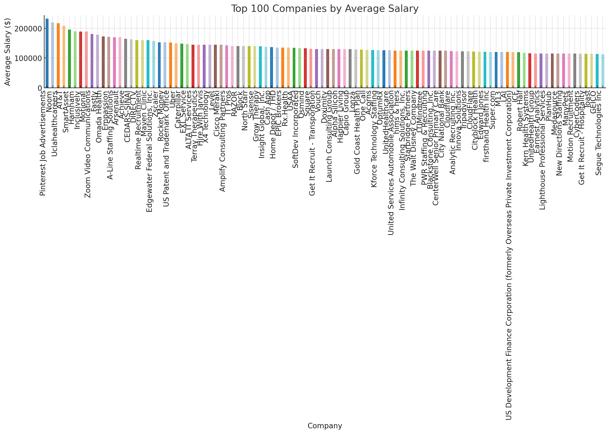

# SQL_project
# Introduction
This project is to showcase my data analysis skills with SQL with job market data 
# Background
During the pause time in my carrier, i decided to spend some time to dive in what are the IT skills that job market demands?? 
# Tools I used
- **SQL**: The backbone of my analysis, allowing me to query the database and unearth critical insights.
-**PostgreSQL**: The chosen database management system, ideal for handling the job posting data.
- **Visual Studio Code**: My go-t for database management and executing SQL queries.
- **Git & GitHub**: Essential for version
control and
sharing
my SQL scripts and analysis, ensuring
collaboration and project tracking.
# Data used
The data I used was provided by the course i followed to complete this project: https://www.youtube.com/watch?v=7mz73uXD9DA 
# The analysis 
1. The first analysis was focusing on the highest paying company names, IT skills and in North America as an analyst

``` sql
--which company pays the best in a role related to analytics in North America??
--what are the IT skills related to those roles? 
with job_posted_salaried as(
        SELECT *
        from job_postings_fact
        where salary_year_avg is not null
),
top_paying_job as(
        select cd.name,
                sd.skills,
                job_title,
                job_schedule_type,
                job_location,
                --assuming north american jobs only
                (cast(salary_year_avg as money)),
                job_posted_date
        from job_posted_salaried
                left join company_dim as cd on job_posted_salaried.company_id = cd.company_id
                left join skills_job_dim as sjd on job_posted_salaried.job_id = sjd.job_id
                inner join skills_dim as sd on sjd.skill_id = sd.skill_id
        where job_title_short like '% Analyst'
                and --only analyst jobs are of interest--
                job_country in ('United States', 'Canada')
                and --assuming north american jobs only
                job_location = 'Anywhere' --location anywhere withitn globe thus including N.A
        order BY salary_year_avg desc
)
select *
from top_paying_job
limit 100
``` 



2. This analysis was focused on top 5 in demand IT skills in North America and average salaries offered. 
